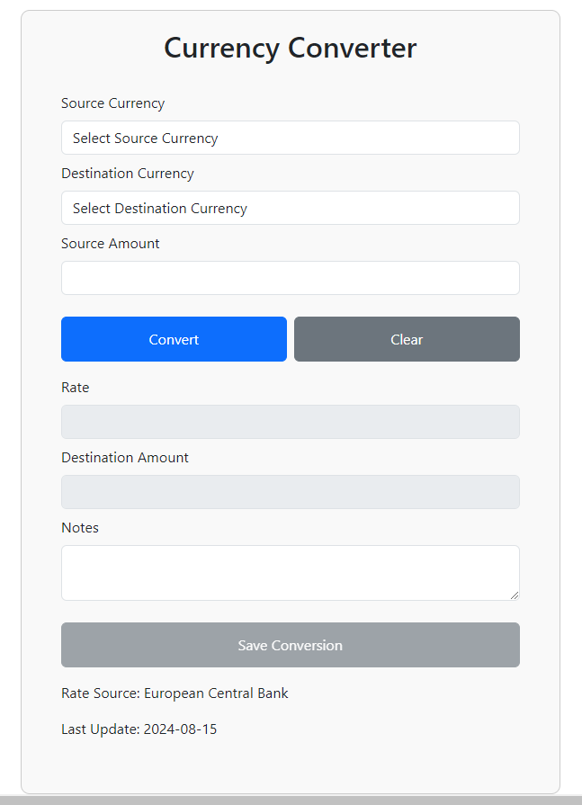
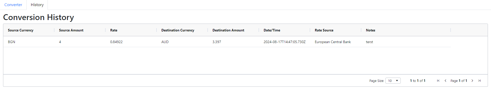
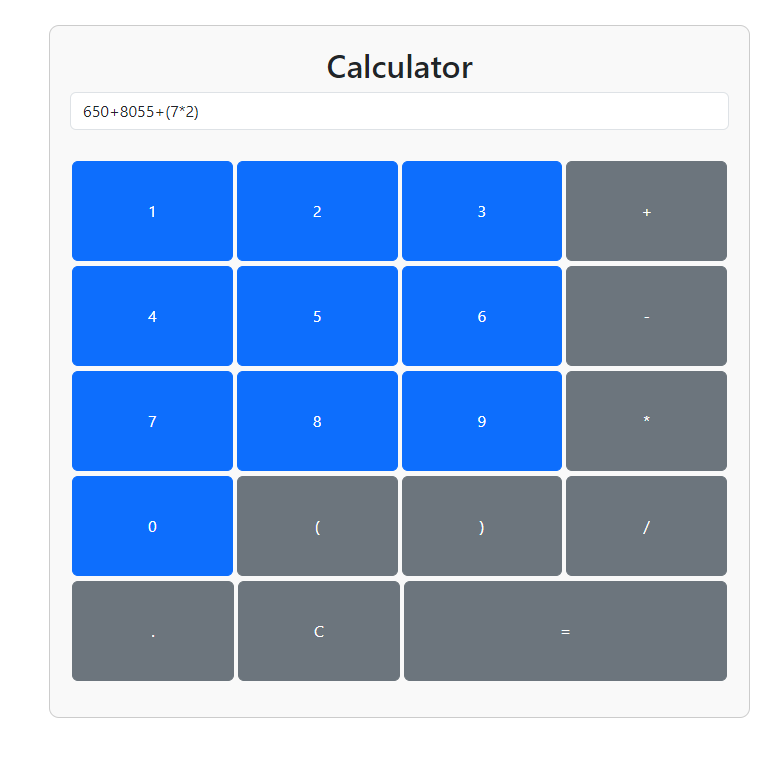

# Advanced Currency Calculator

## Overview

The Advanced Currency Calculator is a Angular/TypeScript web application designed to perform currency conversions, maintain a history of conversions, and provide a basic calculator for arithmetic operations. The application uses Bootstrap for responsive styling and includes best practices for clean and maintainable code.

## Features

1. **Currency Conversion**
   - Convert between different currencies.
   - Display exchange rates sourced from the European Central Bank.

2. **Conversion History**
   - Save and display conversion results.
   - Displays saved conversion history such as source currency, source amount, rate, destination currency, calculated amount, date/time, rate source, and user notes.

3. **Basic Calculator**
   - Perform basic arithmetic operations (addition, subtraction, multiplication, division).
   - Provide a user-friendly calculator interface.

## Functional Requirements

1. **Currency Rates Source**
   - Use the European Central Bank’s XML for rates.
   - Reference:
     - [Rates Source](https://www.ecb.europa.eu/stats/eurofxref/eurofxref-daily.xml)

2. **Conversion**
   - Users select source and destination currencies.
   - Enter source amount and get instant conversion results.

3. **Conversion History**
   - Save conversion results with details.
   - View saved history with all relevant parameters.

## Installation

1. **Clone the Repository**
   ```bash
   git clone https://github.com/navindalmia/adv-currency-calc-ng.git
   cd adv-currency-calc-ng
2. **Install Dependencies**
    npm install 
4. **Start the Development Server**
    npm run dev

5. **Open Your Browser**
  Navigate to the http://localhost:4200/ (Kindly verify the port in terminal after step 3 above.)

## Usage
1. **Currency Converter**
  - Select Source Currency: Choose a currency from the dropdown list.
  - Enter Amount: Input the amount you wish to convert.
  - Select Destination Currency: Choose the target currency.
  - View Result: The converted amount will be displayed instantly.
2. **Conversion History**
  - Save Conversion: Click the "Save" button to record the conversion.
  - View History: Navigate to the History tab to view and manage saved conversions.
3. **Calculator**
   - Perform Calculations: Use the calculator buttons to perform basic arithmetic operations.
   - Clear Inputs: Click the "C" button to reset the calculator.

## Technical Features/ Add-Ons

1.  **Angular and TypeScript web application**
2.  **Responsive UI which works on most common devices (desktop, phone and tablet)**
3.  **Hosted on Azure**
    [See the live project in action](https://red-flower-0ce99bc03.5.azurestaticapps.net)
4.  **Routing**
  The application uses  Router for navigation between the Currency Converter and History pages. The components are displayed in different tabs, and the active tab is highlighted based on user interaction.
5.  **Data Table Component Used for advanced table functionalities for History**


Sample Images from the application<br>






# Angular Project with Docker Support

This project is an Angular application that is containerized using Docker. The Dockerfile provided allows you to easily build and run the application in a Docker container.

## Prerequisites

- Docker: [Install Docker](https://docs.docker.com/get-docker/)


## Building the Docker Image

To build the Docker image for this Angular application, run the following command in the root directory of the project:

```bash
docker build -t my-angular-app .
```


## **AdvCurrencyCalcNg**

This project was generated with [Angular CLI](https://github.com/angular/angular-cli) version 18.1.4.

## Development server

Run `ng serve` for a dev server. Navigate to `http://localhost:4200/`. The application will automatically reload if you change any of the source files.

## Code scaffolding

Run `ng generate component component-name` to generate a new component. You can also use `ng generate directive|pipe|service|class|guard|interface|enum|module`.

## Build

Run `ng build` to build the project. The build artifacts will be stored in the `dist/` directory.

## Running unit tests

Run `ng test` to execute the unit tests via [Karma](https://karma-runner.github.io).

## Running end-to-end tests

Run `ng e2e` to execute the end-to-end tests via a platform of your choice. To use this command, you need to first add a package that implements end-to-end testing capabilities.

## Further help

To get more help on the Angular CLI use `ng help` or go check out the [Angular CLI Overview and Command Reference](https://angular.dev/tools/cli) page.
